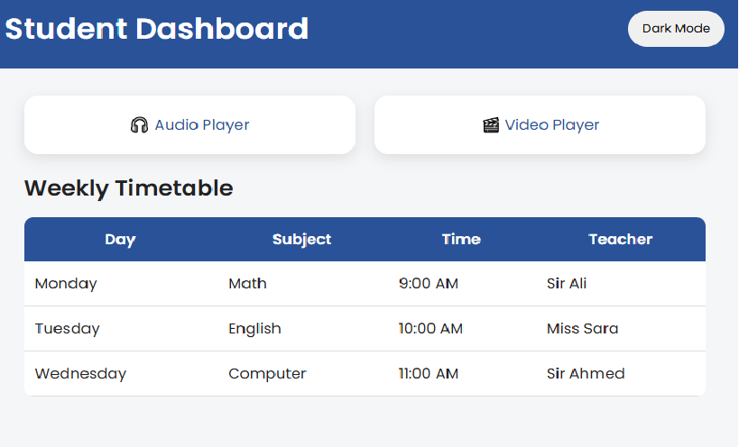

# 🎓 Student Dashboard Pro

A modern and responsive Student Dashboard built using HTML, CSS, and JavaScript.

## 🚀 Features

- 📅 Weekly Timetable
- 🌙 Dark Mode Toggle
- 🎧 Audio Player
- 🎬 Video Player
- 📱 Responsive Design
- ✨ Modern User Interface
- 🖱️ Interactive Table Rows

## 🛠️ Technologies Used

- HTML5
- CSS3
- JavaScript

## 📂 Project Structure

```text
index.html
audio.html
video.html
style.css
script.js
audio.mp3
video.mp4
```

## 🎯 Project Overview

This project provides a simple student dashboard where users can view their weekly timetable, switch between light and dark modes, play audio files, and watch videos through an integrated media section.

## 🔗 Live Demo

(https://fareenak222-create.github.io/Student-Dashboard-Pro/)


## 📸 Screenshot



## 👩‍💻 Author

Fareena Khan

- GitHub: :(https://github.com/fareenak222-create)
- LinkedIn:(https://www.linkedin.com/in/fareena-khan-1bb7a0410/)

---
